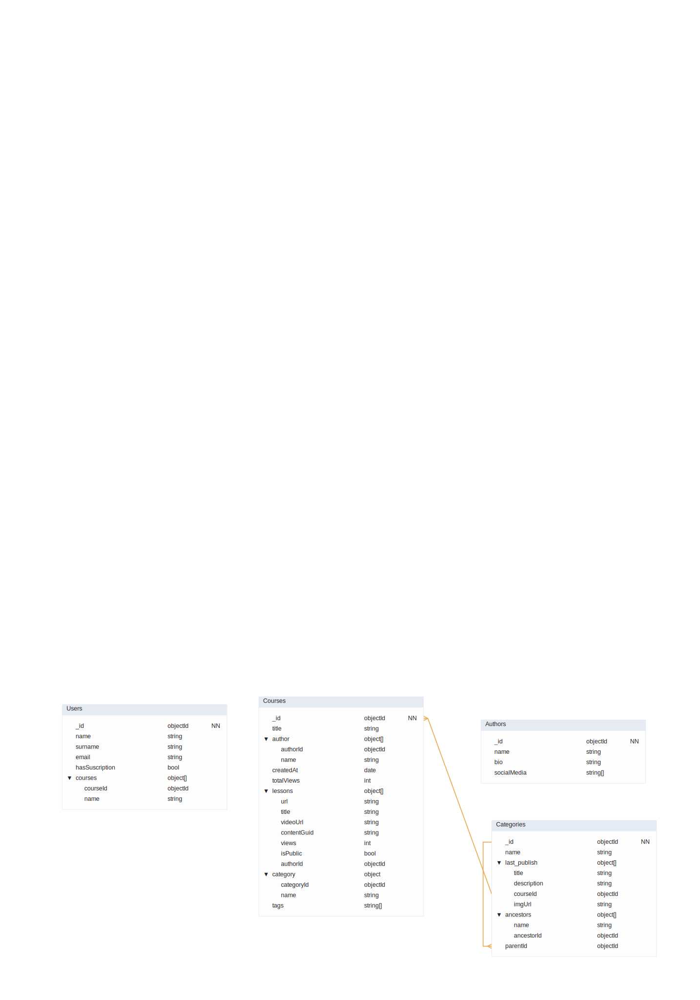

# 🎓 Modelo de Datos Documental: Portal eLearning (Programación)

Este documento recoge el modelo de datos MongoDB para un portal de eLearning. Diseñado para soportar alta carga de lectura en Home y reproductor, con desnormalización selectiva donde el rendimiento lo justifica.

---

## 📦 Resumen de Colecciones

| # | Colección | Descripción |
|---|-----------|-------------|
| 1 | `Courses` | Colección central con contenido y lecciones. |
| 2 | `Categories` | Estructura jerárquica y caché de la Home. |
| 3 | `Authors` | Información biográfica de los instructores. |
| 4 | `Users` | Registro de alumnos y suscripciones. |

---

## 🛠️ Detalle del Esquema

### 1. Colección: `Courses`

Es el eje del portal. Se utiliza el **Extended reference** para autores y categorías, optimizando la visualización de la ficha técnica sin consultas adicionales.

#### Campos principales

| Campo | Tipo MongoDB | Índices / Restricciones | Descripción / Notas |
|-------|-------------|------------------------|---------------------|
| `_id` | `objectId` | PK, Not Null | Identificador único del curso. |
| `title` | `string` | — | Título del curso. |
| `descriptionGuid` | `string` | — | GUID vinculado al contenido descriptivo en el Headless CMS. |
| `author` | `object` | — | Embebido parcial. Ver subdocumento abajo. |
| `category` | `object` | — | Embebido parcial. Ver subdocumento abajo. |
| `lessons` | `array<object>` | — | Embebido. Lista de vídeos y artículos. |
| `createdAt` | `date` | — | Fecha de publicación. Usado para ordenar los últimos cursos publicados. |
| `totalViews` | `int` | — | **Computed Pattern.** Suma total de visitas de todas las lecciones. |
| `tags` | `array<string>` | Multikey Index | Etiquetas para búsqueda rápida y nube de tags. |

#### Subdocumentos embebidos en `Courses`

| Subdocumento | Campo | Tipo | Notas |
|-------------|-------|------|-------|
| `author` | `authorId` | `objectId` | Referencia al autor principal del curso. |
| | `name` | `string` | Nombre cacheado. Evita ir a `Authors` para mostrarlo. |
| `category` | `categoryId` | `objectId` | Referencia a la categoría. |
| | `name` | `string` | Nombre cacheado. Permite filtrar y mostrar el área rápidamente. |
| `lessons[]` | `title` | `string` | Título de la lección. 
| | `videoUrl` | `string` | URL o GUID del vídeo almacenado en CDN / S3. |
| | `contentGuid` | `string` | GUID del contenido del artículo en el Headless CMS. |
| | `isPublic` | `bool` | Controla el acceso: `true` = público, `false` = solo suscriptores. |
| | `views` | `int` | Contador de visualizaciones de la lección. |
| | `authorId` | `objectId` | Autor específico de este vídeo (un vídeo tiene un único autor). |


---

### 2. Colección: `Categories`

Gestiona la navegación jerárquica y los destacados de la página principal.

> 🔗 **Relaciones:** Autorreferencial vía `parentId` y referencia a `Courses` vía `last_publish`.

| Campo | Tipo MongoDB | Índices | Descripción |
|-------|-------------|---------|-------------|
| `_id` | `objectId` | PK| Identificador de la categoría. |
| `name` | `string` | — | Nombre (ej: "Frontend", "Devops"). |
| `parentId` | `objectId` | FK | ID de la categoría padre.  Árbol jerárquico. |
| `ancestors` | `array<object>` | — | **Array of Ancestors Pattern.** Permite generar breadcrumbs. |
| `last_publish` | `array<object>` | — | **Computed Pattern.** Últimos 5 cursos publicados en esta categoría. |

#### Subdocumentos embebidos en `Categories`

| Subdocumento | Campo | Tipo | Notas |
|-------------|-------|------|-------|
| `ancestors[]` | `name` | `string` | Nombre del ancestro cacheado. |
| | `ancestorId` | `objectId` | Referencia al documento ancestro. |
| `last_publish[]` | `title` | `string` | Título del curso. |
| | `description` | `string` | Breve descripción del curso. |
| | `courseId` | `objectId` | Referencia al curso original en `Courses`. |
| | `imgUrl` | `string` | URL de la imagen de portada del curso. |

---

### 3. Colección: `Authors`

Información sobre los autores. Se mantiene independiente para evitar documentos de curso excesivamente grandes. Al ser una página de **baja frecuencia de visita**, no se desnormaliza.

> 🔗 **Relaciones:** Referenciado por `Courses.author.authorId` y `Courses.lessons[].authorId`.

| Campo | Tipo MongoDB | Índices | Descripción |
|-------|-------------|---------|-------------|
| `_id` | `objectId` | PK, Not Null | ID único del autor. |
| `name` | `string` | — | Nombre completo. |
| `bio` | `string` | — | Perfil profesional. Baja frecuencia de lectura, no se desnormaliza. |
| `socialMedia` | `array<string>` | — | Enlaces a perfiles externos (LinkedIn, GitHub, Twitter…). |

---

### 4. Colección: `Users`

Gestiona el acceso al contenido, las suscripciones y las compras de cursos individuales.

> 🔗 **Relaciones:** Vincula al alumno con sus cursos mediante un array de referencias.

| Campo | Tipo MongoDB | Índices | Descripción |
|-------|-------------|---------|-------------|
| `_id` | `objectId` | PK| ID único del usuario. |
| `name` | `string` | — | Nombre del alumno. |
| `surname` | `string` | — | Apellido del alumno. |
| `email` | `string` | Unique | Correo de registro. |
| `hasSubscription` | `bool` | — | `true` si tiene suscripción premium activa. |
| `courses` | `array<object>` | — | Cursos comprados individualmente o en los que está inscrito. |

#### Subdocumento embebido en `Users`

| Subdocumento | Campo | Tipo | Notas |
|-------------|-------|------|-------|
| `courses[]` | `courseId` | `objectId` | Referencia al curso en `Courses`. |
| | `name` | `string` | Nombre del curso cacheado para evitar lookups. |

---

## 🔗 Diagrama de Relaciones

```
Users
  └── courses[].courseId ──────────────────────────────────► Courses
                                                                │
                                              author.authorId ──┼──► Authors
                                        lessons[].authorId ─────┘
                                      category.categoryId ──────────► Categories
                                                                           │
                              last_publish[].courseId ◄────────────────────┘
                              ancestors[].ancestorId ◄───── Categories (self-ref)
                              parentId ◄────────────────── Categories (self-ref)
```

---

## 💡 Justificación de Decisiones de Diseño

### ⚡ Optimización de Lectura
La mayoría de las relaciones son de tipo **Referencia Extendida** (guardando `_id` y `name`). Esto permite que la aplicación sea extremadamente rápida en la navegación, cumpliendo con el requisito de carga fuerte en la página principal y lecciones, sin necesidad de `$lookup` adicionales.

### 🌲 Estructura Jerárquica de Categorías
El **patrón de Ancestros** (`ancestors[]`) en `Categories` permite escalar de 4 categorías a cientos de ellas sin perder rendimiento en la generación de menús de navegación y breadcrumbs, ya que toda la cadena de padres está precalculada en el propio documento.

### 🏠 Home de Alto Rendimiento
El campo `last_publish` en `Categories` implementa el **Computed Pattern**: los últimos 5 cursos por categoría se precalculan y cachean en el documento de categoría. Así la página principal puede resolverse con **una sola query** sobre `Categories`.

### 📈 Escalabilidad de Contenido
Al almacenar solo **GUIDs/URLs** para los recursos pesados (vídeos en CDN/S3, artículos en Headless CMS), la base de datos se mantiene ágil y pequeña, facilitando backups y migraciones a medida que el número de cursos crezca.

### 🔒 Control de Acceso por Lección
El campo `isPublic` dentro de cada objeto de `lessons[]` permite que cada vídeo dentro de un curso puede ser público o privado de forma independiente. Combinado con `Users.hasSubscription` y `Users.courses[]`, se soportan los tres modelos de acceso del enunciado (curso totalmente público, curso mixto, curso de pago).



